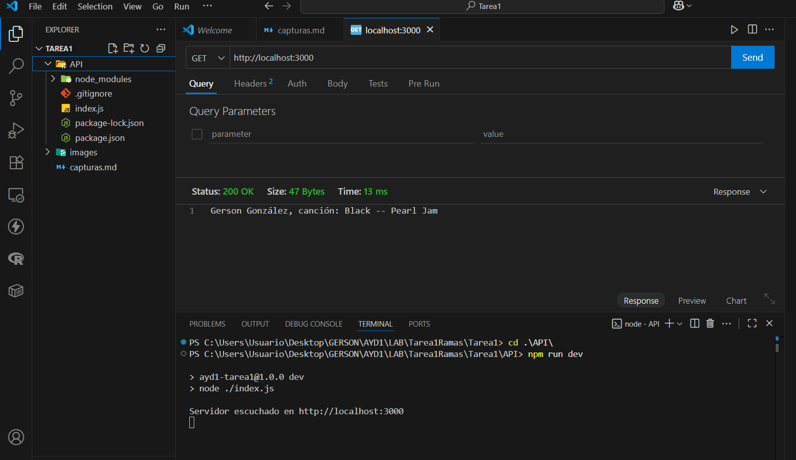
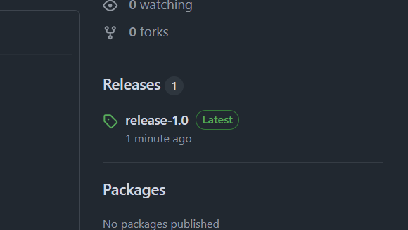
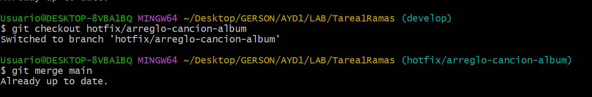
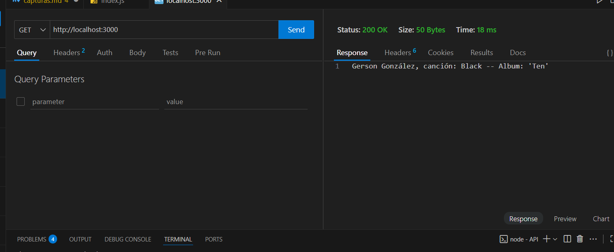
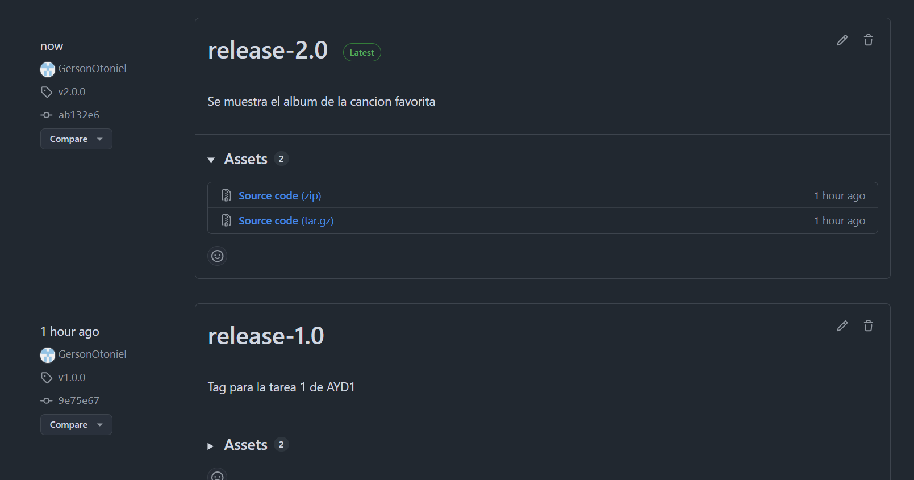
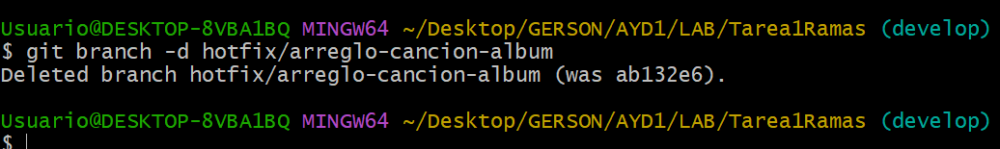
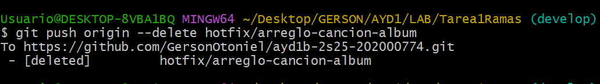

## Capturas de pantalla del proceso

#### Creacion de la api con nombre y cancion

#### Creacion del primer Tag

#### Creacion de la rama hotfix

#### Cambio de mostrar cancion a Album de la cancion

#### Creacion del segundo Tag

#### Eliminacion de la rama hotfix en local

#### Eliminacion de la rama hotfix en el repositorio

